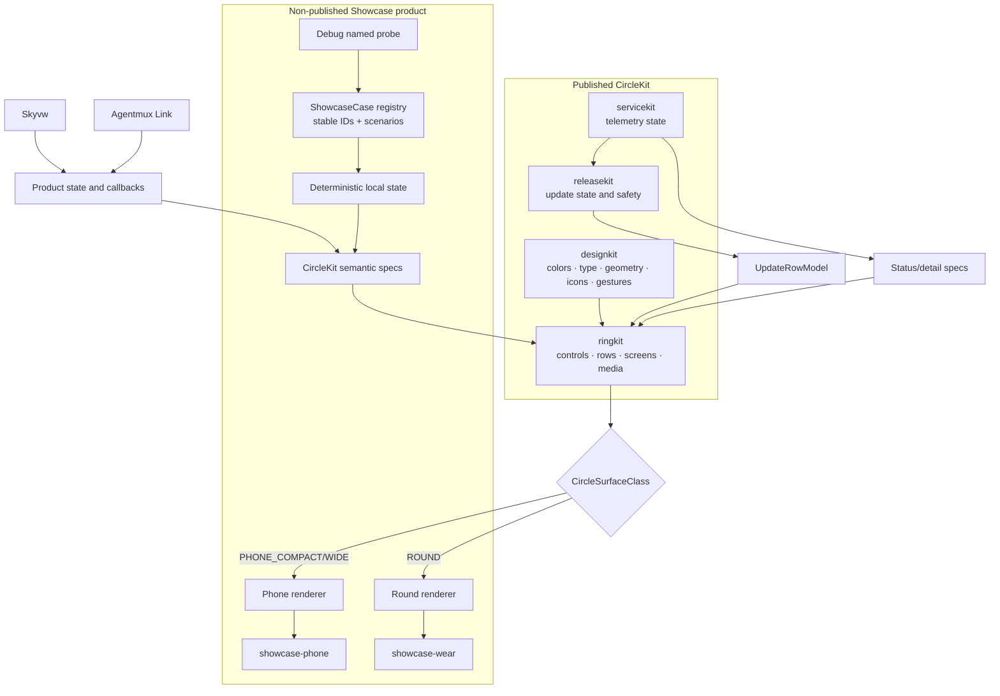
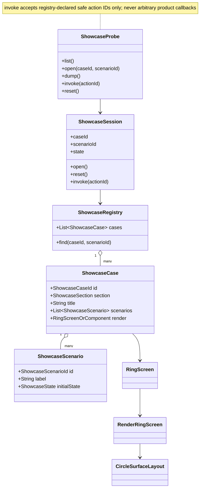

# CircleKit Showcase contract

Status: **accepted after independent Kimi review**. The review corrections and
ownership boundaries below are normative. No showcase implementation may
depart from them without updating this contract first.

## Recommendation

Build a small standalone **CircleKit Showcase** product with two thin Android
hosts (`showcase-phone` and `showcase-wear`) over one deterministic catalog and
CircleKit's existing surface renderers. Do not turn Skyvw's DEV menu into the library test bed: it is a
useful consumer smoke, but it cannot prove that CircleKit is generic and it
already omits several shared components.

The showcase is both:

1. a human component library that Mattias can install and explore; and
2. a named, debug-only probe surface that an agent can drive without pixel
   coordinates.

It is not a third UI dialect, a screenshot mock, a production simulator or a
place for product behavior. Every visible sample renders the real CircleKit
atom/molecule/template from deterministic sample data.

## Requirements captured from Mattias

- CircleKit remains product-neutral and usable by both phone and round Wear.
- Phone and Wear consume the same semantic component/data spec. Host geometry
  may adapt; behavior, timing, state names, color meaning and feedback do not.
- Inventory the current library before adding code. Produce an architecture
  map and identify duplicates, missing components and inconsistent variants.
- Organize the library as understandable Lego blocks: foundations, atoms,
  molecules, templates and flows.
- Include buttons, text input, finite choices/toggles, continuous adjustment,
  instant and deliberate actions, progress/hold feedback, recording waveform,
  playback, menus, layouts and relevant state/error variants.
- Make every sample interactive and side-effect-free. A person must be able to
  exercise normal, disabled, active, in-progress, success, failure, boundary
  and long-content states.
- Provide stable named navigation/probe commands so automated QA can open a
  component and scenario directly. Coordinates remain only for the gesture
  itself when testing a real hold, drag or rotary interaction.
- Test each component family and its meaningful edges at least once on both
  form factors. Use focused local checks and representative screenshots; no
  hosted CI or heavy full-suite path.
- Eventually publish signed Phone and Wear APKs on a direct GitHub release so
  Mattias can hard-test both.
- Keep the implementation declarative, component-based and below the 500-line
  source limit. No copied renderers, fake lookalikes or showcase-only visual
  branches in production components.

## Current architecture inventory

CircleKit currently contains 10,600 production source lines across four
published modules. No production file exceeds 500 lines. The public screen
grammar has seven cases.

### Foundations — `designkit`

| Family | Canonical sources | Responsibility |
| --- | --- | --- |
| Color and type | `GraphiteTokens`, `GraphiteType`, `RingTokens`, `CircleColorScheme`, `CircleColorSchemes`, `CircleAccent` | Product-neutral pigments, type and semantic emphasis |
| Metrics and host shape | `MenuDesign`, `PhoneSurfaceDesign`, `CircleUiProfiles`, `CircleSurfaceLayout`, `CircleSurfaceClass`, `circleHostClip` | One adaptive geometry contract for ROUND, PHONE_COMPACT and PHONE_WIDE |
| Safe geometry | `roundSafeInsetDp`, `roundChordInsetDp`, `roundChromeInsetDp`, `CircleComponentViewport`, `CircleComponentViewportSpec`, `CircleResponsiveSurface`, `MenuGridSpec`, `EdgeMenuDesign` | Circle chords, chrome reservations, scaling and grid capacity |
| Icon language | `RingIcons`, `RingIconsOutline`, `RING_ICON_CATALOG`, accent/style catalogs | One icon vocabulary and filled/outline projections |
| Primitive content | `CircleText`, `CircleIcon`, `CircleStyledIcon`, `CircleCanvas` | Text, icons and canonical canvases |
| Primitive interaction | `circleSafeTap`, `circlePressLifecycle`, `circleSafeTapOrHold`, `CircleActionTiming` | One gesture/timing law |
| Primitive feedback | `CircleLabelProgress`, progress sweep/contour, `CircleChoiceIndicator`, `CircleActionCue` | Hold, work, choice and centre acknowledgement truth |
| Circular atoms | `CircleIconDisc`, `CircleValueDisc`, `CircleIconRing`, `CirclePressIconRing`, `CircleBackDisc` | Label-free actions and shared ring artwork |

### Molecules and templates — `ringkit`

| Family | Canonical sources | Variants/state that must be shown |
| --- | --- | --- |
| Ring controls | `StatRing`, `IconRing`, `BackRing`, `TextAction`, `HoldPill`, `HoldFillBox` | idle, active, disabled, deliberate, destructive |
| Rows | `RingRow`, `RingChoiceRow`, `RowSpec`, `RowKind` | information, action, toggle, choice 2..7, adjustment, work progress, long copy |
| Grids and menus | `CircleGrid`, `CircleMenuOptionSection`, `EdgeMenuSpec` | launcher density/capacity, sections, settings/junk depth |
| Progress | `LabelProgressBar`, `ProgressRing`, `ProgressArcRing`, `measuredWorkLabelProgress` | determinate, indeterminate, empty/unknown |
| Continuous press | `RingPressLifecycle`, `CirclePressIconRing`, `RingActionCueHost` | arming, active, release, cancel, failure, rapid reuse |
| Audio | `RingAudioCaptureFeedback`, `RingPlaybackControls` | waveform/time; ready, playing, paused, complete, failed |
| Text input | `RingTextComposer`, `RingTextInputSpec` | empty, populated, max length, disabled, submit |
| Adjustment | `RingScreen.Adjustment`, `RingAdjustmentScreen` | decrement, increment, optional enable/reset, structured value copy |
| Screen templates | `RingScreen` + `RenderRingScreen` + `RingNavigator` | Hub, Detail, Launcher, Rows, Adjustment, ColorPicker, DialPreview |
| Host projections | `RoundRingScreens`, `PhoneRingScreens`, `PhoneScreenHeader` | same spec rendered on actual round/phone hosts |
| Data lifecycle | `FetchScheduler`, `SourceState`, source contracts | off, loading, fresh, aging, broken, retry/progress |

### Non-visual shared flows

| Module | Public contract | Showcase treatment |
| --- | --- | --- |
| `releasekit` | update state, policy, row model, secure download/verification/install | Render every `UpdateRowModel` state from deterministic fixtures; do not contact a server or install from the component page |
| `servicekit` | operation/transfer/cache telemetry and persistence | Render representative status/detail rows from immutable snapshots; storage mechanics remain unit-tested, not simulated visually |

### Existing consumer test surfaces

- Skyvw has `DEV -> ICONS` and a product-local `DEV -> COMPONENTS` catalog.
  The component catalog covers only rings, rows, actions and source health.
- Skyvw's `tools/menu-probe.sh` drives `RingScreen` menus by name. It is useful
  but product-specific and documents a safety hole: `RowSpec.onTap` does not
  say whether it navigates or causes a side effect, so a generic walker cannot
  safely invoke arbitrary rows.
- Link is now a real CircleKit consumer, including shared press lifecycle,
  action cue, audio capture feedback, playback and text composer. It is a
  product smoke, not a deterministic component catalog.

## Architecture map





## Verified gaps and risks before implementation

1. **The catalog lives in Skyvw, not CircleKit.** It cannot validate the
   library independently and it omits media, text, screen templates,
   release-state projections, action cues and host breakpoints.
2. **Text input is explicitly phone-only.** `RingTextComposer` is documented
   and laid out as a phone molecule. CircleKit needs one semantic text-entry
   contract with a phone inline renderer and a round host port for platform
   text input; a fake tiny watch keyboard is not acceptable.
3. **The audio waveform is fixed at 220 dp.** A canonical round face is 192 dp,
   so `RingAudioCaptureFeedback` can clip instead of deriving width from its
   actual viewport. The showcase should reproduce this first, then the shared
   atom should become constraint/safe-inset driven.
4. **Navigation intent is hidden in closures.** `RowSpec.onTap` cannot tell a
   probe whether it opens a child or performs an action. The showcase registry
   must use explicit safe action IDs. Separately, evaluate making navigation
   intent explicit in the public row/menu data rather than teaching tooling to
   invoke unknown callbacks.
5. **Timing is not uniformly expressible.** `RowSpec` and `EdgeMenuOption`
   carry `CircleActionTiming`, but `ActionSpec` exposes only
   `holdToConfirm`. The showcase timing matrix will reveal whether Detail
   actions require the same data-owned timing vocabulary.
6. **Current spec documentation is stale.** `IMPLEMENTATION-SPEC.md` still
   says Link's composer/PTT remain product-local, while shared text, media and
   press components now exist. Documentation must be corrected in the first
   implementation wave, not copied into the showcase.
7. **No single coverage contract exists.** A new public component can be
   added without a showcase case. A small explicit manifest/registry check is
   needed; it stays a manual focused tool and never enters a hosted CI or
   release gate.
8. **Availability is richer than enabled/disabled.** Link already needs to
   distinguish a recoverable state with an action (for example microphone
   permission) from a blocked state with an honest reason (for example no
   target or route). Flattening both to `disabled` loses the recovery UX.
9. **Floating chrome is part of round safety.** A component can fit a circle
   and still render below X@9 or gear@8. The showcase must reserve real
   `CircleChromeSlot` data and verify content through `roundSafeInsetDp`, not
   add sample-specific padding.

These are candidate fixes, not permission to redesign. Each must first be
reproduced in the showcase or a focused contract test, then fixed in the
shared source and re-rendered on both hosts.

## Proposed module layout

```text
CircleKit/
  designkit/                 # published, unchanged ownership
  ringkit/                   # published, unchanged ownership
  releasekit/                # published, unchanged ownership
  servicekit/                # published, unchanged ownership
  showcase-catalog/          # not published; cases, scenarios, local state
  showcase-phone/            # thin application host
  showcase-wear/             # thin application host
  tools/showcase-probe.sh    # named ADB interface
  docs/showcase/             # generated inventory + representative images
```

`showcase-catalog` depends on the four project modules so it always exercises
the source being edited. Production apps continue to pin immutable Maven
versions. The showcase modules are explicitly excluded from Maven publication.

Both application hosts provide only lifecycle, surface profile, system text
input port and the debug receiver. Catalog/navigation/state code is shared.
`showcase-catalog` is one Android library because it renders Compose content,
but its registry, session, probe protocol and JSON projection live in a
platform-free Kotlin package with no Android imports and focused JVM tests. A
fourth architectural module adds no useful boundary.

The text seam is deliberately small: CircleKit declares
`openPlatformTextEntry(spec, callback)`. Phone may render the existing
`RingTextComposer` inline; Wear delegates to the platform IME. There is no
parallel `CircleTextEntryController` state machine.

## Catalog information model

```kotlin
@JvmInline value class ShowcaseCaseId(val value: String)
@JvmInline value class ShowcaseScenarioId(val value: String)
@JvmInline value class ShowcaseActionId(val value: String)

data class ShowcaseCase(
    val id: ShowcaseCaseId,
    val section: ShowcaseSection,
    val title: String,
    val scenarios: List<ShowcaseScenario>,
    val presentation: ShowcasePresentation,
)

sealed interface ShowcasePresentation {
    data class Screen(val spec: RingScreen) : ShowcasePresentation
    data class Atom(val id: ShowcaseAtomId) : ShowcasePresentation
}
```

There is exactly one catalog entry per visible design. If a public wrapper is
the intended consumer seam, that wrapper is the catalog entry and its lower
atom is not presented as a second component. Anything with an existing spec
form (`RowSpec`, `RingScreen`, `EdgeMenuSpec`, and similar) is instantiated
through that spec. A showcase-local `@Composable` slot is permitted only for a
true atom with no spec form. The production API remains data/spec driven.
Scenario state and actions are named data; no host keeps a switch statement
per component.

Canonical catalog projections:

| Related public symbols | One visible catalog entry |
| --- | --- |
| `RingPressLifecycle`, `CirclePressIconRing` | press action through the lifecycle wrapper |
| `StatRing`, `CircleIconRing`, `CircleValueDisc` | stat ring through its public spec/wrapper |
| `BackRing`, `CircleBackDisc` | back action through `BackRing` |
| `HoldPill`, `HoldFillBox` | hold action through `HoldPill` |
| `ProgressRing`, `ProgressArcRing` | one progress family with its declared variants |
| `CircleIconDisc`, `CircleIconRing` | one icon-action family with shape as data where supported |

This is catalog consolidation, not permission to delete public code before a
consumer and binary-compatibility audit.

Stable ID examples:

- `atom.icon-disc / idle|active|disabled|pressed`
- `control.choice-row / two|seven|toggle|long-copy`
- `control.press-ring / idle|arming|recording|failed`
- `media.capture / silent|active|long-duration`
- `media.playback / ready|playing|paused|complete|failed`
- `input.text / empty|filled|max|disabled`
- `screen.rows / empty|mixed|max-choice|long-copy`
- `flow.update / checking|available|downloading|ready|failed`

## Named probe contract

The debug APK exposes one non-exported-to-release receiver action:

`io.v1d.circlekit.showcase.PROBE`

Commands return one JSON line under a stable log tag:

```text
list
open    --es case control.press-ring --es scenario arming
dump
invoke  --es action begin
reset
back
```

`tools/showcase-probe.sh` wraps quoting, serial selection, response timeout and
screenshot capture:

```sh
tools/showcase-probe.sh --device phone open control.press-ring arming
tools/showcase-probe.sh --device wear shot media.playback playing /tmp/play.png
```

The probe may set deterministic state and invoke only registry-declared,
showcase-local safe action IDs. It never invokes an arbitrary `RowSpec.onTap`
or other product callback. Navigation intent remains showcase-local until a
second production consumer proves that it belongs in CircleKit's public API.
It must not claim a real hold/drag/rotary gesture passed unless ADB or a human
actually performs that gesture. Release APKs retain the visible scenario
picker but do not register the broadcast receiver.

## Required scenario matrix

Every family is exercised on `ROUND`, `PHONE_COMPACT` and `PHONE_WIDE` where
the component supports that host.

| Dimension | Minimum cases |
| --- | --- |
| Interaction | idle, early release, completion, rapid reuse, disabled, callback failure |
| Availability | available, recoverable with named action, blocked with honest reason |
| Timing | immediate 0 ms, deliberate 200 ms, longer confirm/hold from data |
| Work | none, indeterminate, 0%, 50%, 100%, failure/retry |
| Choice | toggle, 2 options, 7 options, first/middle/last selection |
| Content | empty, normal, long title/sub/hint, max-length text, tabular values |
| Media | no samples, active waveform, long duration, pause/resume/stop/failure |
| Navigation | root, child, nested adjustment, back, state retained, reset |
| Geometry | 192 dp round, common Wear diameters, compact portrait, wide/landscape, large font |
| Chrome reservation | no chrome, X@9, X@9 + gear@8; content remains centred and unobscured |
| Theme | every supported `CircleColorTheme`, active/supporting/danger/disabled accents |

Invalid constructor inputs remain focused unit tests, not crash buttons in the
human gallery.

## Implementation waves and stop conditions

### Wave 0 — lock the contract

- Kimi reviewed this inventory, UML, missing-state list and module split.
- Corrections are incorporated and the document is marked `accepted`.
- No application code before the component taxonomy and probe safety are
  agreed.

**Done:** both reviews name the same ownership boundaries: showcase owns
registry/session/probe; CircleKit owns all pixels and gesture law; hosts own
only lifecycle, text-entry port and debug receiver. No open question changes
module topology.

### Wave 1 — deterministic shell and foundations

- Add the three showcase modules and two thin hosts.
- Implement registry/session/navigation and visible section/scenario picker.
- Add named debug probe and wrapper script.
- Show tokens, icons, surface profiles, safe geometry and basic atoms.

Proof: direct named navigation on Phone and Wear plus representative images;
no copied CircleKit pixel code.

### Wave 2 — interaction and state laboratory

- Add circular actions, rows, choices, adjustments, progress and action cues.
- Exercise instant, deliberate, confirm, early release and rapid reuse.
- Fix only reproduced shared-component defects; publish a new CircleKit Maven
  version before any consumer bump.

Stop condition: the exact Maven artifact must be fetched back and proven to
contain the change before Skyvw or Link may pin it. A locally published or
unpublished version is never valid consumer evidence.

Proof: focused interaction tests plus manual real holds on both devices.

### Wave 3 — text and media

- Define the missing cross-host text-entry seam without inventing a watch
  keyboard.
- Add capture waveform, press-to-record and playback scenarios.
- Reproduce the fixed-width waveform on round hosts, then make the shared atom
  constraint/viewport-driven and re-render it on both hosts. A showcase-only
  width override is forbidden.

Proof: Phone inline text, Wear platform text entry, recording lifecycle and
playback controls all use the shared semantic specs.

### Wave 4 — templates and shared flows

- Exercise all seven `RingScreen` cases and navigator/back behavior.
- Add source-health/fetch, ReleaseKit update-row and ServiceKit status fixtures.
- Add empty, max-capacity and long-content cases.

Proof: registry coverage test says every declared public showcase family and
all `RingScreen` cases have at least one case; no network or installer side
effect occurs inside the gallery.

### Wave 5 — consumer cleanup and publication

- Replace or remove Skyvw's product-local component gallery rather than leave
  two catalogs. Keep `DEV -> COMPONENTS` only as a link/launcher if valuable.
- Smoke Skyvw and Link against the resulting immutable CircleKit version.
- Build signed Showcase Phone/Wear APKs from one exact SHA.
- Publish one GitHub release with direct Phone and Wear assets and a compact
  inventory report.

Proof: fresh installs on physical/emulated Phone and Wear, direct GitHub links,
and no private/sibling dependency in either production consumer.

## Verification policy

- No GitHub Actions and no heavy suite.
- Before each merge: fetch/rebase, only named tests for the touched component,
  build the touched showcase host, and run one bounded named visual scenario.
- A recurring defect earns one focused regression test. Screenshot matrices
  are manual/on-demand tools, not a release gate.
- Visual proof always records source SHA, host class, viewport and scenario ID.
- Publishing happens only after the exact public Maven artifacts and APK
  signatures/digests are independently read back.
- Manifest coverage is reciprocal and comes from one declared family list:
  every family has at least one registry case, and every registry case names a
  declared family. This is a focused JVM test; KSP or a binary-API toolchain is
  unnecessary until the honest proxy proves insufficient.

## Decisions made now

- Standalone product, not a Skyvw-only DEV expansion.
- Two real hosts, one shared catalog/session.
- Project-module dependencies for developing the kit; immutable Maven pins for
  production consumers.
- Stable named probe plus visible scenario picker.
- Real components with deterministic fake data, never fake renderers.
- Existing Skyvw gallery is retired or reduced after parity, not maintained as
  a second truth.

## Kimi-reviewed decisions

- Keep one Android `showcase-catalog` plus the two application hosts; keep its
  state/probe protocol platform-free by package contract and JVM test rather
  than creating a fourth module.
- Use a small host text-entry port, not a new controller abstraction.
- Keep navigation intent showcase-local and expose only safe action IDs.
- Use one reciprocal manifest/registry coverage test; no KSP.
- Consolidate wrappers and their lower atoms as one visible catalog entry.
- Treat Maven publication and read-back as a hard stop before consumer bumps.

Independent review verdict: **ACCEPT WITH CORRECTIONS**, all corrections now
incorporated.
